# Ближайший план разработки Code Sanitizer

**Актуально на:** 2026-09-16
**Назначение:** краткая карта работ до устойчивой keyboard prompt-защиты и
последующего расширения на файлы. Подробная история, evidence и отчёты о review
хранятся в `tickets.md`.

## Карта зависимостей

```mermaid
flowchart TD
    Done["[x] Prompt-защитный фундамент\n273, 297-340"]
    R341["[x] 341\nЕдиный глубокий resident runtime\nC: 78/100 ■■■■■■■■□□\nD: 70/100 ■■■■■■■□□□"]
    R342["[x] 342\nTray = проекция resident state\nC: 54/100 ■■■■■□□□□□\nD: 45/100 ■■■■□□□□□□"]
    R345["[x] 345\nResident workflow coordinator\nC: 76/100 ■■■■■■■■□□\nD: 70/100 ■■■■■■■□□□"]
    R343["[x] 343\nРазделить profile и input adapters\nC: 71/100 ■■■■■■■□□□\nD: 65/100 ■■■■■■■□□□"]
    T344["[x] 344\nИзолировать suite от установленного tray\nC: 42/100 ■■■■□□□□□□\nD: 35/100 ■■■■□□□□□□"]
    R346["[x] 346\nImmutable admission evidence\nдо native callback\nC: 68/100 ■■■■■■■□□□\nD: 60/100 ■■■■■■□□□□"]
    A347["[x] 347\nАтомарный resident workflow transaction\nC: 86/100 ■■■■■■■■■□\nD: 82/100 ■■■■■■■■□□"]
    A348["[ ] 348\nФинальное acceptance-закрытие\nC: 60/100 ■■■■■■□□□□\nD: 72/100 ■■■■■■■□□□"]
    A349["[x] 349\nSetup/recovery race-матрица\nC: 76/100 ■■■■■■■■□□\nD: 68/100 ■■■■■■■□□□"]
    A350["[x] 350\nЕдиная OpenAI Desktop identity\nC: 72/100 ■■■■■■■□□□\nD: 66/100 ■■■■■■■□□□"]
    E351["[x] 351\nКонтракт уровней доказательств\nC: 76/100 ■■■■■■■■□□\nD: 72/100 ■■■■■■■□□□"]
    C352["[x] 352\nResident live canary\ninstalled red evidence\nC: 70/100 ■■■■■■■□□□\nD: 80/100 ■■■■■■■■□□"]
    T359["[x] 359\nDeterministic .NET 10 SDK resolver\nC: 45/100 ■■■■■□□□□□\nD: 32/100 ■■■□□□□□□□"]
    T360["[x] 360\nSafe NuGet restore diagnosis\nC: 41/100 ■■■■□□□□□□\nD: 30/100 ■■■□□□□□□□"]
    T361["[x] 361\nImmutable canary admission\nclassification -> execution\nC: 73/100 ■■■■■■■□□□\nD: 67/100 ■■■■■■■□□□"]
    S353["[x] 353\nProtectedComposerSession\nlocally_verified\nC: 83/100 ■■■■■■■■□□\nD: 78/100 ■■■■■■■■□□"]
    C363["[x] 363\nПолный clipboard snapshot/restore\nC: 69/100 ■■■■■■■□□□\nD: 62/100 ■■■■■■□□□□"]
    T354["[x] 354\nProtectedSendTransaction\nрядом с legacy\nC: 86/100 ■■■■■■■■■□\nD: 84/100 ■■■■■■■■□□"]
    R355["[x] 355\nReference через production UIA\nC: 96/100 ■■■■■■■■■■\nD: 100/100 ■■■■■■■■■■"]
    P356["[>] 356\nProduction keyboard migration\nC: 98/100 ■■■■■■■■■■\nD: 100/100 ■■■■■■■■■■"]
    G357["[ ] 357\nEvidence-gated installer/release\nC: 82/100 ■■■■■■■■□□\nD: 75/100 ■■■■■■■■□□"]
    X358["[ ] 358\nУдалить legacy и закрыть 348\nC: 88/100 ■■■■■■■■■□\nD: 90/100 ■■■■■■■■■□"]
    R314["[~] 314\nБезопасный первый mouse Send\nC: 93/100 ■■■■■■■■■□\nD: 96/100 ■■■■■■■■■■"]
    Keyboard["Клавиатурная prompt-защита\nповторная release-приёмка"]
    R323["[x] 323\nOpaque compatibility fingerprints\nC: 35/100 ■■■■□□□□□□\nD: 28/100 ■■■□□□□□□□"]
    R324["[x] 324\nКанонический fixture discovery\nC: 45/100 ■■■■■□□□□□\nD: 38/100 ■■■■□□□□□□"]
    Ingress["[!] 283\nПодтвердить pre-cloud ingress\nдля проектных файлов\nC: 100/100 ■■■■■■■■■■\nD: 100/100 ■■■■■■■■■■"]
    Files["[!] 286\nИсключение .env и других файлов\nиз cloud context\nC: 78/100 ■■■■■■■■□□\nD: 75/100 ■■■■■■■■□□"]

    Done --> R341
    R341 --> R342
    R341 --> R345
    R345 --> R342
    R341 --> R343
    R343 --> R346
    R346 --> R314
    R341 --> A347
    R342 --> A347
    R345 --> A347
    R346 --> A347
    A347 --> A349
    A349 --> A350
    A347 --> E351
    A349 --> E351
    A350 --> E351
    E351 --> C352
    T359 --> T360
    C352 --> S353
    E351 --> T361
    S353 --> T361
    S353 --> C363
    T361 --> T354
    C363 --> T354
    T354 --> R355
    R355 --> P356
    P356 --> G357
    G357 --> X358
    X358 --> A348
    X358 --> Keyboard
    T344 -. "нужен для честной\nполной проверки" .-> Keyboard
    R342 --> Keyboard
    R346 --> Keyboard
    R314 -. "mouse Send остаётся отключён\nдо завершения" .-> Keyboard
    Keyboard --> R323
    R323 --> R324
    X358 -. "до расширения\nfile ingress" .-> Ingress
    R324 --> Ingress
    Ingress --> Files
```

Сплошные стрелки — текущие зависимости. Пунктирные — исторический либо
не-критический путь.

## Как читать план

| Метка | Значение |
|---|---|
| `[x]` | Работа принята на указанном в ticket уровне evidence. |
| `[>]` | Единственный текущий критический ticket. |
| `[ ]` | Следующая работа после выполненных зависимостей. |
| `[~]` | Отдельная ветка, не блокирующая основной путь. |
| `[!]` | Внешняя блокировка: разработка не устранит её без подтверждённой точки интеграции. |

Закрытая задача не равна production claim: уровень evidence в `tickets.md`
определяет, доказан ли deterministic, reference или installed/live результат.

## Сложность и затраченная мощность

Карта показывает две независимые шкалы от `1` до `100`. Каждая полоса состоит
из десяти квадратов и округляет значение для быстрого сравнения.

| Шкала | Вопрос, на который отвечает |
|---|---|
| `C` — техническая сложность | Насколько трудны архитектура, изменения кода и число взаимодействующих границ? |
| `D` — стоимость доставки | Сколько фактической мощности потребовала закрытая задача или, для открытой, вероятно потребует: исследования, fix/review-раунды, native/external зависимости, ручная приёмка и неопределённость среды? |

Для закрытых ticket `D` — ретроспективный факт нагрузки по evidence, а не
выдуманное число токенов. Для открытых `D` — прогноз. Точные исторические
токены не отображаются: они не записывались единообразно и создали бы ложную
точность.

Шкала `1–20` означает локальную механическую работу; `21–40` — ограниченный
компонент; `41–60` — несколько файлов и целевую проверку; `61–80` — сквозную
интеграцию; `81–100` — native/Windows, security, ручную приёмку или внешнюю
инфраструктуру.

`P50` и `P90` ниже — прогноз числа пятичасовых рабочих лимит-циклов. `P50`
означает обычный сценарий, `P90` — реалистичный плохой сценарий. Это бюджет
мощности, а не календарное обещание: лимит, модель, доступность Sandbox и
ручной evidence меняют длительность.

Калибровка уже выполненных работ: 354 получила `C=86`, но `D=84`, потому что
оставалась в детерминированном reference-контуре. 355 получила `C=96` и
`D=100`: production-shaped UIA, native capture, interactive acceptance,
Sandbox/receipt-инфраструктура и несколько независимых доказательных каналов
сделали её значительно тяжелее в доставке, чем показывает одна шкала
сложности.

## Рекомендуемая последовательность

| Порядок | Ticket | Цель | C | D | Бюджет лимит-циклов |
|---:|---|---|---:|---:|---|
| 1 | **356** `[>]` | Перевести production keyboard Send на `ProtectedSendTransaction`; сохранить исходный canary 352 и сделать его зелёным на том же seam. | 98 | 100 | `P50: 8–16`, `P90: 16–32`, высокая неопределённость |
| 2 | **357** `[ ]` | Разрешать installer/release claim только при совпадающих deterministic, reference и installed evidence. | 82 | 75 | `P50: 3–6`, `P90: 7–12` |
| 3 | **358** `[ ]` | Удалить legacy owner после миграции и доказать отсутствие второй active side-effect машины. | 88 | 90 | `P50: 5–10`, `P90: 12–20` |
| 4 | **348** `[ ]` | Повторно закрыть umbrella-ticket ссылками на полный набор evidence. | 60 | 72 | `P50: 2–4`, `P90: 5–8` |

Отдельные ветки не начинаются раньше своих зависимостей:

| Ticket | Условие старта | C | D | Бюджет лимит-циклов |
|---|---|---:|---:|---|
| **314** `[~]` | После устойчивой keyboard release-приёмки; mouse Send не включать в capability claim раньше. | 93 | 96 | `P50: 8–16`, `P90: 16–32` |
| **283** `[!]` | Нужна подтверждённая supported pre-cloud точка ingress в Codex/ChatGPT Desktop. | 100 | 100 | Не прогнозируется до нахождения точки интеграции |
| **286** `[!]` | Только после 283: enforcement для `.env` и произвольных файлов. | 78 | 75 | `P50: 4–8`, `P90: 10–16` после 283 |

До завершения 356 production keyboard protection не получает новый claim
`live_verified`; status и installer должны оставаться честными относительно
фактического уровня evidence.
