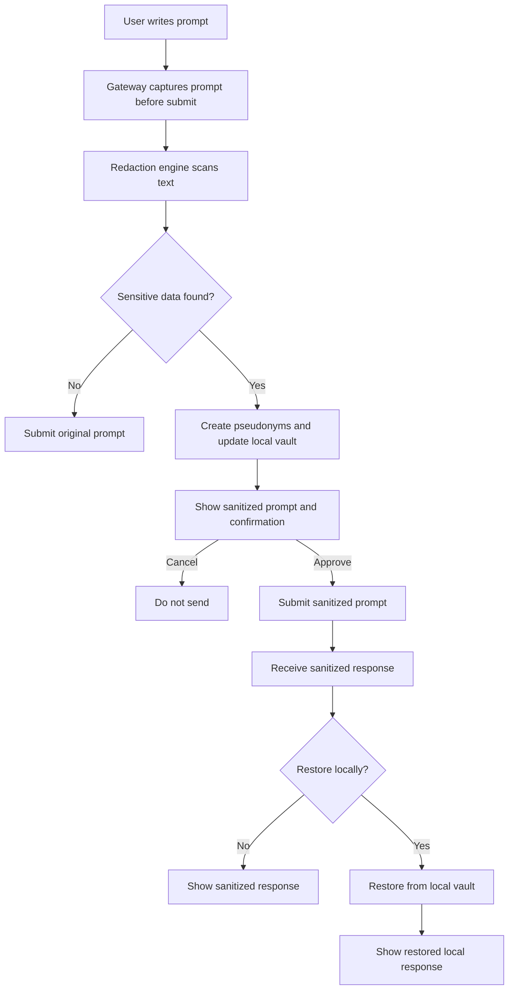
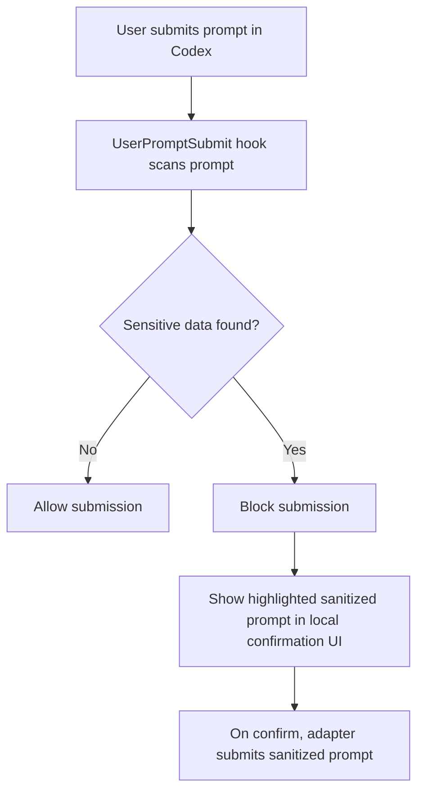
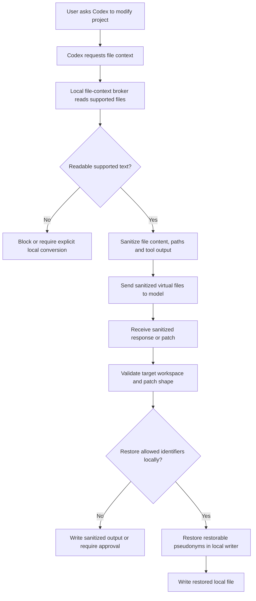

# Architecture

## Overview

Codex Redaction Gate is a local system with three layers:

1. Capture layer: receives a prompt before cloud submission.
2. Redaction layer: detects sensitive entities, replaces them and records mappings.
3. Restoration layer: optionally restores sanitized model output locally.

The central architectural requirement is simple: the original prompt must not be sent to the cloud after sensitive data is detected.

The MVP is Windows-first and uses .NET for the local orchestrator, file-based vault, local confirmation UI and adapter layer.

## Components

### Gateway Adapter

Responsible for integration with the user interface or Codex runtime.

Responsibilities:

- Capture pending prompt text.
- Call the redaction engine.
- Display confirmation UI when changes are needed.
- Submit sanitized prompt if the user approves.
- Prevent original prompt submission if redaction fails.
- Route model response to restoration UI.

Possible implementations:

- Codex hook adapter: best for detection and blocking.
- Local composer: a small app where the user writes prompts and sends sanitized content to Codex.
- Desktop overlay: intercepts composer text and submit action at OS/app level.
- Browser/extension adapter: intercepts web composer submit if the user works through a browser.
- Future native Codex extension: ideal if Codex exposes prompt rewriting before submission.

The detailed interception design is described in `PROMPT_INTERCEPTION.md`. The current architecture treats Codex `UserPromptSubmit` as guard mode because documented behavior supports prompt inspection and blocking, while prompt rewriting for this event is not assumed. The MVP replacement flow requires a minimal gateway/composer, desktop adapter, browser extension, or future verified rewrite API that owns the submit action and can implement `Confirm sanitized prompt`.

For the user's current workflow, the next UX frontier is not a browser adapter, a separate composer or a hotkey-first workflow. It is an OS-level desktop adapter for the Windows Codex/ChatGPT app: the user types in the normal app composer, presses the selected AI app's configured Send shortcut, Code Sanitizer intercepts and suppresses that submit input locally, then sends only a safe original prompt or approved `sanitized_text`. The detailed decision is captured in `OS_ADAPTER_UX_DEMO_SPEC.md` and `adr/ADR-004-native-submit-interception-primary.md`.

The OS adapter seam is intentionally platform-neutral above the concrete adapter: enabled AI profile selection, active surface discovery, submit binding discovery, submit input interception, text capture, text replacement, submit action, secondary hotkey trigger and confirmation overlay are separate contracts. Windows uses a Windows-specific adapter and Codex/ChatGPT surface profiles first. Future Linux desktop support should replace the platform adapter only. Future CLI support should be wrapper mode, not terminal keystroke interception.

Native submit interception protects the composer submit path only. It does not, by itself, protect a full coding-agent workflow where project files are read from disk and sent to the model as context. Project-file protection requires a separate file-context broker that owns file reads, supported text extraction, sanitized virtual file delivery, restore-aware writes and raw-free evidence for every file-derived cloud-bound payload. This boundary is captured in `adr/ADR-005-project-file-context-requires-a-restore-aware-broker.md`.

### Redaction Engine

Pure local library that transforms text.

Input:

- one or more text content parts from prompt text, clipboard, text attachment, file snippet or tool output;
- policy context;
- project context;
- optional dictionaries;
- vault handle.

Output:

- sanitized text;
- entity list;
- mapping operations;
- warnings;
- decision: allow, confirm, block.

The engine should be deterministic and heavily tested.

The detailed sanitizer design is described in `SANITIZER_DESIGN.md`. The important implementation constraint is that replacement must be span-based, not repeated string replacement: detectors return offsets in the original prompt, the span resolver selects a non-overlapping final set, the policy engine assigns actions, the vault allocates pseudonyms, and the renderer builds the sanitized prompt in one pass.

The engine contract is:

```text
sanitize(raw_text, context) -> allow | confirm | block
```

Cloud-bound adapters may submit only `sanitized_text` from this result. If the engine returns `confirm`, submission waits for local approval. If the engine returns `block`, the adapter must prevent original submission.

### Detector Registry

Runs specialized detectors:

- URL detector.
- Domain detector.
- Email detector.
- IP/CIDR detector.
- Secret detector.
- Connection string detector.
- File path detector.
- Dictionary detector.
- Custom regex detector.

Detectors return normalized entity candidates with confidence, type and replacement policy.

Existing open-source detectors should be reused where they fit. The current MVP decision in `adr/ADR-003-mvp-scanner-composition.md` uses a source-built Gitleaks binary as the first secret-scanning backend, built-in technical scanners for non-secret infrastructure identifiers, and custom dictionary/regex scanners for organization-specific terms. Presidio and TruffleHog are deferred until packaging/runtime questions are resolved.

### Policy Engine

Decides what to do with each entity.

Examples:

- `https://learn.microsoft.com/...` may be allowed.
- `https://internal.example.local/...` must be pseudonymized.
- `Bearer eyJ...` must be redacted and marked non-restorable.
- `Customer X` from dictionary must be pseudonymized.

Policy levels:

- Global.
- Organization.
- Project.
- Temporary session override.

The policy model is described in `POLICY_MODEL.md`. Sensitivity rules are policy-as-data: built-in detectors catch common patterns, while local policy files and dictionaries define company-specific sensitive values. Users must be able to manually add customer names, product names, project names, domains, URL prefixes and custom regex rules without changing sanitizer code.

### Mapping Vault

Local protected file-based store for deterministic replacements.

Suggested logical schema:

```text
mapping_id
entity_type
normalized_original_ciphertext
display_pseudonym
hmac_prefix
first_seen_at
last_seen_at
created_by_policy
restorable
notes
```

The vault must support lookup by normalized original value and reverse lookup by pseudonym.

MVP storage is `vault.json` or `vault.jsonl` with atomic temp-file replace and in-memory indexes. The HMAC/encryption secret is protected by DPAPI or equivalent OS-protected storage. SQLite is deferred unless file-based storage becomes unreliable or too slow.

### HMAC Service

Creates deterministic pseudonym suffixes.

Properties:

- Uses local secret.
- Includes entity type in the HMAC input.
- Normalizes input before hashing.
- Produces short display suffixes, with collision handling.

Example pseudonym:

```text
URL_8F3A21B9
DOMAIN_19C0E44A
EMAIL_BA1080F2
```

### Confirmation UI

Shows the user what will be sent.

Must display:

- sanitized prompt;
- highlighted replacement spans;
- counts by entity type;
- high-risk warnings;
- `Confirm sanitized prompt` / cancel / edit actions.

Should not show raw original values by default.

### Restoration UI

Receives sanitized answer and offers local restoration.

Modes:

- keep sanitized;
- restore all restorable pseudonyms;
- restore selected types;
- copy sanitized;
- copy restored.

Restored output should be visibly marked as containing real values.

## Current Implementation Snapshot

As of the post-MVP sanitizer refactor, the implemented architecture matches the safety shape above and the public sanitizer entry point has been reduced to a local orchestration shell. The extraction is intentionally internal: public contracts and adapter behavior stay stable while pipeline roles are isolated for future detector, policy and UX work.

Implemented modules:

- Core contracts expose content parts, sanitizer decisions, replacements, warnings and raw-free audit metadata.
- The sanitizer orchestrator accepts prompt text, text attachments and file snippets through one content-part request shape.
- Unsupported binary/PDF/Office/image attachment metadata is fail-closed by default.
- Gitleaks integration exists as an external scanner adapter with redacted JSON, finding conversion and fail-closed timeout/error handling.
- Built-in detectors cover synthetic markers, secret-shaped values, technical identifiers, connection strings, paths, private IP/CIDR, emails, internal URLs and domains.
- CSV dictionaries and TOML policy files define manual sensitive terms, allow rules, block rules, custom regex rules and scanner settings.
- The mapping vault uses deterministic local HMAC pseudonyms, file-backed persistence, atomic writes and explicit dev-only plaintext mode.
- DPAPI-protected secret storage supplies the local HMAC secret for production use.
- Confirmation UI contracts and submit-owning adapter tests prove that `Confirm sanitized prompt` submits only `sanitized_text`.
- The Codex hook shell is guard mode: it blocks unsafe originals and invokes the confirmation flow without relying on undocumented prompt rewriting.
- Local restoration can replace restorable pseudonyms and marks restored output as local-sensitive so it is not accidentally resubmitted.
- Internal sanitizer decision metadata uses typed internal values for entity type, detector id, action and scanner status, while public result and audit contracts remain string-compatible.
- Raw-free decision trace metadata is stored in audit scanner-status metadata with `trace.*` keys for stage status, reason codes, detector/type/action counts and verification status.
- `FileAuditSink` can persist local raw-free audit events under the user-local audit directory with atomic writes and count-based retention; configured audit persistence failures block sensitive confirm decisions.
- Scanner runtime validation checks the configured Gitleaks artifact and provenance before scanner-backed operation; invalid configuration is represented as a fatal raw-free `configuration_error`.
- Scanner runtime validation also enforces that the local Gitleaks binary SHA-256 matches the source-build provenance.
- `AttachmentIngestion` covers readable text attachments and file snippets as content parts, and unsupported binary attachment metadata remains fail-closed.
- `PlainTextAttachmentIntake` reads supported UTF-8 plain-text files into content parts with size/type caps; unsupported types remain fail-closed.
- Readiness, policy activation, policy precedence, audit summary and release smoke components provide raw-free operational diagnostics around the sanitizer core.
- Package smoke checks cover sanitizer allow/confirm, scanner-backed secret redaction, guard blocking, local restore, storage defaults, scanner artifact provenance, scanner config validation, confirm handoff and attachment ingestion boundary.
- Native submit interception is now the primary target UX for the Windows desktop adapter. Existing hotkey paths are treated as diagnostic/manual secondary features until the submit-binding profile manager and input suppression path are implemented.
- Full project-file workflow protection is not implemented yet. The current implementation can sanitize explicit file snippets or plain-text attachments when they are passed through the sanitizer API, but it cannot guarantee that arbitrary Codex project file reads, model-visible tool outputs, attachment uploads or generated patches are sanitized and locally restored.

Current sanitizer pipeline responsibilities:

- content-part concatenation and source-offset mapping;
- unsupported attachment guard;
- policy block-rule evaluation;
- external scanner budget orchestration;
- Gitleaks finding consumption;
- dictionary, synthetic, built-in secret and technical identifier detection;
- public URL/domain allowlist checks;
- overlap resolution;
- replacement planning and vault allocation;
- rendering;
- sanitized-output verification;
- raw-free decision trace creation;
- audit event creation;
- local audit persistence when configured;
- tamper-evident audit chain verification;
- readiness and release smoke diagnostics;
- final `allow | confirm | block` result assembly.

Implemented sanitizer pipeline:

```text
Sanitizer orchestration shell
  -> ContentPartAssembler
  -> AttachmentGuard
  -> PolicyBlockEvaluator
  -> ExternalScannerOrchestrator
  -> DetectorRegistry
      -> SyntheticDetector
      -> BuiltInSecretDetector
      -> GitleaksFindingDetector
      -> TechnicalIdentifierDetector
      -> DictionaryDetector
  -> SpanResolver
  -> ReplacementPlanner
  -> SanitizedTextRenderer
  -> SanitizedOutputVerifier
  -> SanitizerDecisionTrace
  -> AuditEventBuilder
  -> FileAuditSink (optional)
  -> SanitizationResultAssembler
Operational diagnostics
  -> ReadinessDoctor
  -> ManagedSensitiveDictionary
  -> PolicyActivationStore
  -> PolicyPrecedenceReporter
  -> AuditChainVerifier
  -> AuditSummaryReporter
  -> ReleaseReadinessSmokeRunner
```

The public `ISanitizer` API remains the main test seam after extraction. Future changes must preserve current behavior, audit safety, fail-closed behavior and package smoke coverage.

## Architecture Check: Post-Refactor Improvement Readiness

The current architecture is described sufficiently for the next implementation wave:

- the cloud boundary remains local-first and fail-closed;
- guard mode remains honest about Codex hook limits;
- the submit-owning adapter path remains the only happy path for `Confirm sanitized prompt`;
- the mapping vault and HMAC secret remain local user assets;
- the sanitizer is now an orchestration shell over focused pipeline components;
- package smoke proves the core MVP safety loop plus scanner config validation, confirm handoff and attachment ingestion boundaries.

The completed improvement wave did not redesign the cloud boundary or add broad scanner dependencies. The next changes should build on the strengthened pipeline. The next-frontier operating plan is captured in `NEXT_IMPROVEMENT_SPEC.md`: richer policy operations, better gateway UX, tamper-evident audit logs, scanner packaging hardening and release readiness smoke should be implemented as separate vertical slices.

## Data Flow

### Full Gateway Mode



### Guard Mode



Pure hook-only guard mode is safer than nothing, but it does not fully satisfy the desired UX if Codex cannot replace the prompt programmatically. The MVP must include a submit-owning adapter path for `Confirm sanitized prompt`.

### Protected Project File Mode



This mode is a future product requirement, not current composer protection. It is the only mode that can honestly claim `project_files_protected`.

## Integration Strategy

### Phase 1: Local Engine, Guard and Minimal Confirm Adapter

- Build redaction engine.
- Build file-based mapping vault.
- Build command-line tester.
- Build Codex `UserPromptSubmit` hook to block unsafe prompts.
- Build minimal local confirmation UI with highlighted replacements.
- On confirm, adapter submits only `sanitized_text`; clipboard is fallback only.

### Phase 2: Polished Gateway UX

- Add selected AI surface profiles for Windows Codex/ChatGPT Desktop.
- Discover or verify the selected app's configured submit binding.
- Intercept and suppress native submit input only for enabled verified AI profiles.
- Refine full approve-and-send flow using the verified submit binding.
- Add response restoration UI.

### Phase 3: Managed Enforcement

- Package as a Codex plugin or managed hook bundle if supported.
- Add organization policy distribution.
- Add tamper-evident audit logs.
- Optionally lock protected AI profiles and disallow hotkey-only degradation in managed environments.

## Boundary With Codex Hooks

Known hook behavior must be verified before implementation. If `UserPromptSubmit` only supports blocking, then it cannot implement transparent replacement alone. The architecture must not rely on unsupported private behavior.

If a future Codex API supports returning an updated prompt from `UserPromptSubmit`, the Gateway Adapter can become a thin hook adapter.

## Storage Locations

Suggested Windows locations:

- Policy: `%USERPROFILE%\.codex-redaction-gate\policy`
- Vault: `%USERPROFILE%\.codex-redaction-gate\vault`
- Audit: `%USERPROFILE%\.codex-redaction-gate\audit`
- HMAC secret: Windows Credential Manager or DPAPI-protected store

Raw originals must never be stored in project repositories.

## Failure Modes

- Detector crash: block submission.
- Vault unavailable: block submission for sensitive prompts.
- Confirmation UI unavailable: block submission and show recovery instructions.
- HMAC secret missing: block submission until initialized.
- Pseudonym collision: extend suffix length or add deterministic collision suffix.
- Selected AI submit binding unknown: show `binding_unknown`; do not claim protected mode.
- Selected AI surface no longer matches verified profile: show `surface_unverified`; do not claim protected mode.
- Native submit interception fails after matching a protected profile: suppress original submit and fail closed.
- User bypass outside selected AI apps: log only if detectable; otherwise out of scope.
