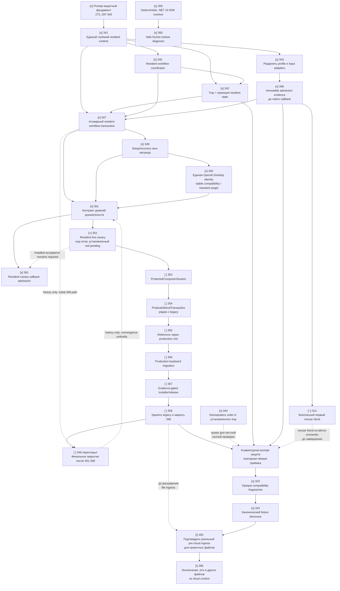

# Ближайший план разработки Code Sanitizer

**Актуально на:** 2026-08-26
**Назначение:** сохранить историю построенного prompt-защитного пути и показать
текущий путь к доказуемой, устойчивой архитектуре до расширения защиты файлов.

## Как читать план

| Метка | Значение |
|---|---|
| `[x]` | Работа завершена и является фундаментом для следующих шагов. |
| `[>]` | Ближайшая выполняемая работа. |
| `[~]` | Может идти после указанной зависимости, но не является текущим критическим путём. |
| `[!]` | Внешняя блокировка: разработка не устранит её без подтверждённой точки интеграции. |

## Что уже построено

Основной prompt-защитный фундамент построен как единый вертикальный путь:

- [x] Атомарные resident snapshots и fail-closed маршрутизация выбранных
  профилей: 273, 274, 251, 253, 265–267, 277–278.
- [x] Коррелированная операция protected Send, единый владелец overlay,
  revalidation target и raw-free trace: 297, 301–306, 310–313, 315–322.
- [x] Автоматический onboarding, operational lifecycle, журнал, readiness и
  разделение resident admission от release/CI evidence: 325–340.
- [x] Статус честно разделяет `composer_protected` и
  `project_files_protected`; при отсутствии реальной точки ingress файлы
  остаются `project_file_ingress_unsupported`.

Ручные проверки подтвердили перехват и замену, но повторяющиеся регрессии
write/replay показали, что внутренняя реализация пока не имеет одного глубокого
владельца транзакции и production-эквивалентного красно-зелёного acceptance.
Поэтому старые закрытые задачи остаются историей построенного фундамента, а 348
архитектурно переоткрыт до завершения нового convergence-пути 351-358.

## Текущий источник истины

Следующая задача на текущем этапе — **352**. Её кодовая часть уже находится в
коммите `2d99fe2b`, но задача ещё не закрыта: нужно запустить canary на
установленном кандидате и получить сохранённый raw-free `reproduced_red`
артефакт. Это не заменяется `--self-test`, `--product-smoke` или
детерминированными тестами.

**351 закрыта. 348 не является следующей задачей:** это итоговый umbrella-
тикет, который можно закрыть только после всей цепочки `352 -> 353 -> 354 ->
355 -> 356 -> 357 -> 358`. Пока доказательство 352 не получено, следующую
кодовую задачу 353 не начинаем.

### Исправления инструментирования и canary (359-361)

Три корректирующих тикета добавлены поверх истории и не меняют критический
порядок основного convergence-пути:

| Тикет | Статус | Результат | Связь с текущим gate |
|---:|---|---|---|
| **359** | `[x]` | Release build и restore используют один проверяемый resolver .NET 10 SDK; runtime-only `dotnet.exe` не принимается как SDK. | Независимый prerequisite для tooling |
| **360** | `[x]` | Restore wrapper явно сообщает состояние NuGet/TLS и сохраняет включённую проверку подписей. | Не меняет 352; live restore зависит от сети |
| **361** | `[x]` | Resident canary admission проходит через callback с валидным target identity и каноническим trace. | Исправляет локальный red-тест; установленное доказательство всё ещё требует 352 |

`359-361` не являются заменой установленному acceptance 352. Они закрывают
ошибки tooling и deterministic callback proof, после чего следующий ручной
шаг остаётся прежним: запустить canary на совпадающем установленном кандидате
и сохранить `reproduced_red`.

## Карта зависимостей

Сплошные стрелки показывают текущие зависимости. Пунктирные стрелки
сохранены только для истории и не означают порядок выполнения.

## Рекомендуемая последовательность

### Этап 1. Закрепить resident runtime

| Очерёдность | Тикет | Результат | Зависимости |
|---:|---|---|---|
| 1 | **341** `[x]` | Tray использует компактный UI-порт и immutable snapshot; workflow coordinator использует внутренний workflow-порт. Тесты покрывают failed candidate, stale callback и parallel reload без mixed-state. | 340 завершён |
| 2 | **345** `[x]` | Coordinator владеет setup, retry, local recovery и readiness; acceptance-матрица покрывает success, cancellation, stale candidate, rollback и recovery failure. | 341 |
| 3 | **342** `[x]` | Tray хранит только UI-порт, отображает published state и отправляет явные intents. | 345 |
| 4 | **343** `[x]` | Profile verification/storage отделены от low-level keyboard/pointer input adapter; status и live-contract arm собираются до запуска hook. | 341 |
| параллельно | **344** `[x]` | Полный automated suite изолирован от установленного tray через уникальные per-test instance IDs; `1726/1726` прошли при запущенном installed tray. | Нет |
| 5 | **346** `[x]` | Resident публикует immutable admission evidence до callback; callback не вызывает provider и не выполняет I/O. | 343 |

**Контрольная точка после этапа 1:** автоматические проверки пройдены:
`1759/1759`, `--self-test` и `--product-smoke`. Для ручной приёмки собран
installer `0.1.20260822.t1325` из commit `3622ef22`; остаётся установить его и
выполнить ограниченную проверку **клавиатурной** отправки в выбранном OpenAI
Desktop composer.

### Этап 1.5. Углубить уже построенный resident путь

Этот этап не меняет модель защиты и не добавляет новый способ отправки. Он
уменьшает количество мест, где могут появиться смешанные решения о состоянии,
перед началом file-ingress работ.

Таблица ниже сохранена как историческая запись этапа 1.5. Текущий порядок
определяется картой и таблицей этапа 1.6; строка 348 здесь больше не является
текущим acceptance gate.

| Очерёдность | Тикет | Результат | Зависимости |
|---:|---|---|---|
| 1 | **347** `[x]` | Activation, profile commit и terminal publication линеаризованы; race-матрица 349 исключает mixed-state при cancellation/newer operation. Предыдущее завершение сохранено в `tickets.md` как история. | 341, 342, 345, 346 |
| 2 | **348** `[history]` acceptance pending | Историческая запись первичного acceptance gate; финальное закрытие теперь выполняется только после цепочки 351-358. | 347, 323, 324, 346 |
| 3 | **349** `[x]` | Детерминированно доказаны setup/recovery cancellation, newer operation и rollback failure; 347 повторно закрыт, а 348 ждёт installer-matched release proof. | 347 |
| 4 | **350** `[x]` | Store-пакет `OpenAI.Codex` с `ChatGPT.exe` и окном Codex представлен одной стабильной identity; handle окна и UIA runtime ID отделены в transient target и не инвалидируют профиль после перезапуска. | 323, 324, 346, 349 |

**Gate этапа 1.5:** до начала `283`/`286` и нового file-ingress кода должны быть
зелёными полный automated suite, `--self-test`, `--product-smoke` и
детерминированная reference-composer матрица. `314` остаётся отдельной задачей
для mouse Send и не является условием запуска 347/348.

**Текущее доказательство после 350:** `1782/1782`, `--self-test`,
`--product-smoke` и Release build без предупреждений и ошибок. Installer
`0.1.20260822.t1325` остаётся в истории как предыдущий candidate и не содержит
ремонт 350. Для следующей ручной release-приёмки опубликована и запущена
сборка `0.1.20260823.t1841` из `artifacts/publish`.

### Этап 1.6. Сделать protected Send доказуемым глубоким модулем

Этот этап нужен для сходимости будущих исправлений. Сначала появляется средство,
которое воспроизводит реальный установленный путь на текущей архитектуре. Только
после этого меняется архитектура. Так мы не меняем одновременно измерительный
прибор и сам механизм.

Ниже находится текущая последовательность выполнения. `[>]` означает единственный
активный gate; `[ ]` — следующая работа после успешного gate. 348 намеренно
перенесён в конец как финальная проверка сходимости.

| Очерёдность | Тикет | Результат | Зависимости |
|---:|---|---|---|
| 1 | **351** `[x]` | Единая шкала `proposed -> reproduced_red -> implemented -> locally_verified -> live_verified -> released`; validator и CLI smoke запрещают преждевременный fixed claim. | Нет |
| 2 | **352** `[>]` | Запустить resident-owned canary на установленном кандидате и сохранить raw-free `reproduced_red` с точной installed build. Кодовая часть уже в `2d99fe2b`; installed acceptance ещё pending. | 351 |
| 3 | **353** `[ ]` | `ProtectedComposerSession` скрывает target-scoped UIA/STA/focus/read/write/verify/replay за компактным контрактом. | 352 |
| 4 | **354** `[ ]` | `ProtectedSendTransaction` становится единственным владельцем admitted attempt, side effect и terminal publication; сначала рядом с legacy. | 353 |
| 5 | **355** `[ ]` | Reference composer использует production `NativeVerifiedComposerTextAccess`, а не прямую запись в fixture TextBox. | 354 |
| 6 | **356** `[ ]` | Production keyboard Send переведён на transaction; canary 352 становится зелёным без изменения исходного assertion. | 355 |
| 7 | **357** `[ ]` | Installer и release claim принимают только совпадающее deterministic/reference/live evidence. | 356 |
| 8 | **358** `[ ]` | Legacy state owners удалены; широкий host и дублирующая protected-Send машина исчезли; 348 повторно закрыт. | 351-357 |
| 9 | **348** `[ ]` | Финально закрыть umbrella-тикет только со ссылками на все доказательства 351-358. | 352-358 |

**Gate этапа 1.6:** полный suite и smoke необходимы, но недостаточны. Для одной
и той же сборки должны пройти transaction matrix, reference composer через
production access adapter и installed resident canary. `sent_safely` означает
локально проверенную sanitized-запись, успешную инъекцию replay и terminal
publication; это не утверждение о получении сообщения облаком.

До завершения 352 новые догадочные правки write/replay не выполняются. Если
canary не умеет воспроизвести ошибку, исправляется canary или диагностика, а не
production state machine.

### Журнал выполнения этапа 1.6 (добавлено 2026-08-26)

Этот журнал добавлен поверх исходной карты и не заменяет и не удаляет старые
задачи, связи или исторические отметки.

| Дата | Тикет | Добавлено в доказательство | Результат |
|---|---:|---|---|
| 2026-08-26 | **351** | Typed evidence-state contract, schema и transition history, raw-free сериализация, внешняя проверка artifact binding, отдельный validator smoke в release publish. | `[x]` `1846/1846`, contract CLI passed, release publish validator smoke passed, final review без замечаний |
| 2026-08-26 | **352** | Следующий новый рабочий пункт: resident-owned canary должен сначала воспроизвести текущий установленный keyboard Send-путь на том же production seam. | `[ ]` реализация не начиналась |
| 2026-08-26 | **352** | Resident-owned canary, lifecycle, target-generation guard, production UIA/write wiring, overlay trace, raw-free evidence и installer identity sidecar добавлены; ложный green replay запрещён. | `[>]` deterministic `1856/1856`, build и installer smoke прошли; installed red artifact и безопасный production replay ещё не доказаны |
| 2026-08-26 | **352** | После финальной проверки commit `69a68046` содержит canary и remediation admission поверх `2d99fe2b`; deterministic suite проверен как `1857/1857`. | `[>]` следующая пользовательская операция: rebuilt installed canary с сохранением `reproduced_red`; 353 заблокирована до этого артефакта |
| 2026-08-26 | **352** | Старый установленный кандидат `0.1.20260826.t1227` воспроизвёл красный дефект: marker прошёл в OpenAI Desktop без overlay. Commit `69a68046` добавляет canary admission до обычной classification и покрыт focused callback-тестами. | `[>]` установить rebuilt candidate из `69a68046` и повторить canary; до этого 352 и 353 остаются заблокированы |
| 2026-08-26 | **359** | Общий resolver выбирает только host с .NET 10 SDK и используется build/restore entry points. | `[x]` PowerShell syntax, SDK 10.0.400 и release build verified |
| 2026-08-26 | **360** | Restore wrapper отделяет SDK failure от NuGet/TLS failure и не ослабляет signature validation. | `[x]` `restore_status=passed` в текущей среде; сетевой failure path диагностически покрыт |
| 2026-08-26 | **361** | Callback admission использует resident armed state; fixture содержит `window_handle`, а trace начинается с обязательных `composer_read` и `sanitized`. | `[x]` focused canary callback test passed; installed 352 acceptance остаётся pending |
| 2026-08-26 | **352** | UX canary: resident marker автоматически копируется в Windows clipboard после стадии `armed`; при отказе показывается ручной fallback, marker не попадает в журнал или evidence. | `[x]` focused workflow tests `3/3`; installed `reproduced_red` acceptance остаётся pending |
| 2026-08-26 | **352** | Исправлена потеря installer identity с `+commit` и добавлен raw-free `target_verification_failed` для отказа до capture; второй Send после terminal canary не считается частью той же попытки. | `[>]` focused `15/15`; установленное evidence нужно повторить на rebuilt candidate |

Review-исправления 351 завершены в тех же границах задачи: live/released
evidence теперь требует внешнего build/target binding, history защищается от
мутации, а синтетическая contract-проверка явно не считается release proof.
Новых самостоятельных задач между 351 и 352 не добавлено: фактический
следующий шаг остаётся **352**, а production artifact/release gate остаются
владельцами последующих 357-358.

### Этап 2. Закрыть оставшиеся точечные риски prompt-защиты

| Очерёдность | Тикет | Результат | Зависимости |
|---:|---|---|---|
| 6 | **314** `[~]` | Первый клик по Send безопасно решается из resident evidence до UIA; нет глобальной блокировки навигации. | Формально 297 и 309 завершены; архитектурно после 346, до keyboard release-приёмки |
| 7 | **323** `[x]` | Compatibility evidence хранится и сравнивается как явно opaque fingerprint; значения не хешируются повторно. | После keyboard release-приёмки; 346 завершён |
| 8 | **324** `[x]` | Один канонический fixture для verified ChatGPT discovery; тесты и product smoke используют одну схему evidence. | 323 |
| 9 | **362** `[ ]` | Замена hostname внутри структурированного `host:/path/` сохраняет суффикс пути; неоднозначный путь блокируется без частичной записи. | 352 |

**Правило до завершения 314:** пользовательский mouse Send не считается
защищённым и не должен включаться в capability claim. Защищённым путём остаётся
только проверенная клавиатурная комбинация.

### Этап 3. Отдельная ветка: защита файлов

| Статус | Тикет | Что требуется на самом деле |
|---|---|---|
| `[!]` | **283** | Не «дописать broker», а найти и подтвердить реальную supported pre-cloud точку, через которую Codex/ChatGPT Desktop получает project files, attachments и file-derived tool output. Альтернатива: согласованный локальный gateway, который действительно владеет этими операциями. |
| `[!]` | **286** | После 283 добавить UI и enforcement для `.env` и произвольных файлов, исключаемых из cloud context. |

`283` заблокирован не кодом проекта, а отсутствием подтверждённой интеграционной
точки в Windows Codex/ChatGPT Desktop. До её появления сохраняется честный
статус `project_file_ingress_unsupported`; локальный broker не следует выдавать
за защиту реальных project reads.

## Что делать прямо сейчас

1. Завершить текущий gate 352: запустить установленный resident canary и
   получить сохранённый красный результат текущего keyboard-пути; результат
   deterministic smoke не заменяет live evidence.
2. Только после артефакта 352 выполнять 353-356 маленькими последовательными
   срезами; после каждого
   запускать нижние уровни доказательств, а после 356 превратить тот же canary в
   зелёный.
3. Выполнить 357-358, собрать совпадающий installer и только затем повторно
   закрыть 348 и возобновить расширение file ingress.

## Границы, которые нельзя размывать

- Tray не принимает решение, защищена ли отправка: он только отображает
  published resident state.
- Ошибка, неопределённость или устаревшее состояние выбранного target всегда
  блокируют исходный Send; они не создают дополнительный pass-through путь.
- Защита composer не равна защите файлов.
- До реального ingress seam нельзя обещать, что Codex/ChatGPT Desktop не
  отправит в облако содержимое файлов проекта.
- Каждая новая задача должна определять владельца состояния, fail-closed
  состояние, допустимые переходы и детерминированное доказательство.
- `Implemented` не означает `fixed`: без красного воспроизведения и зелёного
  результата на требуемом уровне изменение остаётся неподтверждённым.
- Reference fixture не может подменять production adapter прямой записью в
  control; такой тест не является доказательством UIA/write/replay пути.
- State-machine и Windows UIA adapter меняются отдельными срезами, чтобы у
  регрессии оставался один вероятный владелец.
