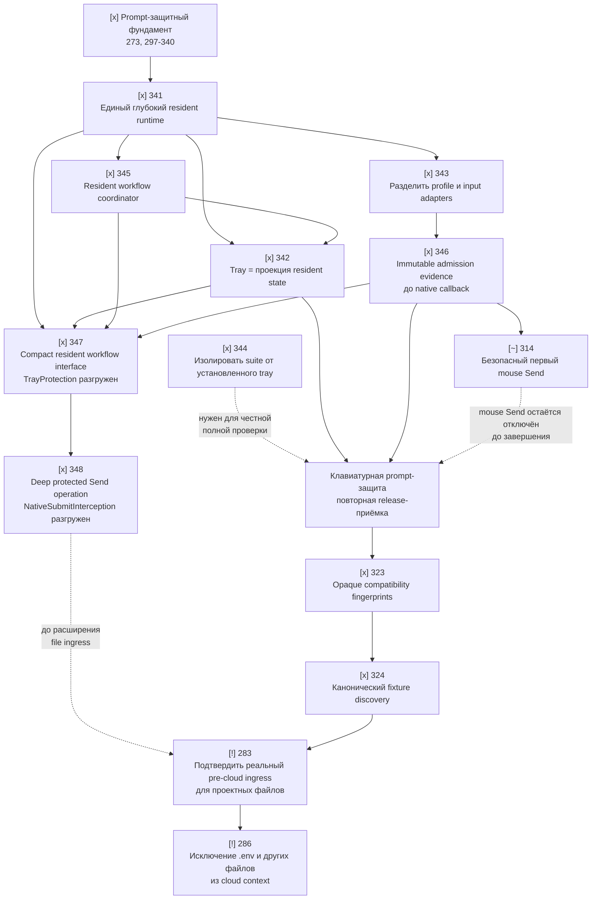

# Ближайший план разработки Code Sanitizer

**Актуально на:** 2026-08-15
**Назначение:** показать последовательность работ после приёмки основного
prompt-защитного пути и до начала расширения защиты файлов.

## Как читать план

| Метка | Значение |
|---|---|
| `[x]` | Работа завершена и является фундаментом для следующих шагов. |
| `[>]` | Ближайшая выполняемая работа. |
| `[~]` | Может идти после указанной зависимости, но не является текущим критическим путём. |
| `[!]` | Внешняя блокировка: разработка не устранит её без подтверждённой точки интеграции. |

## Что уже построено

Основной prompt-защитный слой завершён как единый вертикальный путь:

- [x] Атомарные resident snapshots и fail-closed маршрутизация выбранных
  профилей: 273, 274, 251, 253, 265–267, 277–278.
- [x] Коррелированная операция protected Send, единый владелец overlay,
  revalidation target и raw-free trace: 297, 301–306, 310–313, 315–322.
- [x] Автоматический onboarding, operational lifecycle, журнал, readiness и
  разделение resident admission от release/CI evidence: 325–340.
- [x] Статус честно разделяет `composer_protected` и
  `project_files_protected`; при отсутствии реальной точки ingress файлы
  остаются `project_file_ingress_unsupported`.

Это означает: **не нужно менять принцип работы защиты промптов**. Ближайшая
работа направлена на то, чтобы закрепить уже работающую логику в более простых
и устойчивых модулях.

## Карта зависимостей

## Рекомендуемая последовательность

### Этап 1. Закрепить resident runtime

| Очерёдность | Тикет | Результат | Зависимости |
|---:|---|---|---|
| 1 | **341** `[x]` | Tray использует компактный UI-порт и immutable snapshot; workflow coordinator использует внутренний workflow-порт. Тесты покрывают failed candidate, stale callback и parallel reload без mixed-state. | 340 завершён |
| 2 | **345** `[x]` | Coordinator владеет setup, retry, local recovery и readiness; acceptance-матрица покрывает success, cancellation, stale candidate, rollback и recovery failure. | 341 |
| 3 | **342** `[x]` | Tray хранит только UI-порт, отображает published state и отправляет явные intents. | 345 |
| 4 | **343** `[x]` | Profile verification/storage отделены от low-level keyboard/pointer input adapter; status и live-contract arm собираются до запуска hook. | 341 |
| параллельно | **344** `[x]` | Полный automated suite изолирован от установленного tray через уникальные per-test instance IDs; `1726/1726` прошли при запущенном installed tray. | Нет |
| 5 | **346** `[x]` | Resident публикует immutable admission evidence до callback; callback не вызывает provider и не выполняет I/O. | 343 |

**Контрольная точка после этапа 1:** автоматические проверки уже пройдены:
`1733/1733`, `--self-test` и `--product-smoke`; установленный tray оставался
запущенным во время полного suite. До ручной приёмки и перехода к mouse Send
необходимо пересобрать installer и выполнить одну ограниченную ручную проверку
**клавиатурной** отправки в выбранном OpenAI Desktop composer.

### Этап 1.5. Углубить уже построенный resident путь

Этот этап не меняет модель защиты и не добавляет новый способ отправки. Он
уменьшает количество мест, где могут появиться смешанные решения о состоянии,
перед началом file-ingress работ.

| Очерёдность | Тикет | Результат | Зависимости |
|---:|---|---|---|
| 1 | **347** `[x]` | Один компактный resident workflow interface владеет lifecycle, readiness, candidate activation/rollback и terminal publication; tray остаётся проекцией snapshot. | 341, 342, 345, 346 |
| 2 | **348** `[x]` | Correlated protected Send operation владеет stage ordering, target revalidation, overlay, write, replay и raw-free terminal trace; Windows adapters не принимают самостоятельных submit/replay решений. | 347, 323, 324, 346 |

**Gate этапа 1.5:** до начала `283`/`286` и нового file-ingress кода должны быть
зелёными полный automated suite, `--self-test`, `--product-smoke` и
детерминированная reference-composer матрица. `314` остаётся отдельной задачей
для mouse Send и не является условием запуска 347/348.

### Этап 2. Закрыть оставшиеся точечные риски prompt-защиты

| Очерёдность | Тикет | Результат | Зависимости |
|---:|---|---|---|
| 6 | **314** `[~]` | Первый клик по Send безопасно решается из resident evidence до UIA; нет глобальной блокировки навигации. | Формально 297 и 309 завершены; архитектурно после 346, до keyboard release-приёмки |
| 7 | **323** `[x]` | Compatibility evidence хранится и сравнивается как явно opaque fingerprint; значения не хешируются повторно. | После keyboard release-приёмки; 346 завершён |
| 8 | **324** `[x]` | Один канонический fixture для verified ChatGPT discovery; тесты и product smoke используют одну схему evidence. | 323 |

**Правило до завершения 314:** пользовательский mouse Send не считается
защищённым и не должен включаться в capability claim. Защищённым путём остаётся
только проверенная клавиатурная комбинация.

### Этап 3. Отдельная ветка: защита файлов

| Статус | Тикет | Что требуется на самом деле |
|---|---|---|
| `[!]` | **283** | Не «дописать broker», а найти и подтвердить реальную supported pre-cloud точку, через которую Codex/ChatGPT Desktop получает project files, attachments и file-derived tool output. Альтернатива: согласованный локальный gateway, который действительно владеет этими операциями. |
| `[!]` | **286** | После 283 добавить UI и enforcement для `.env` и произвольных файлов, исключаемых из cloud context. |

`283` заблокирован не кодом проекта, а отсутствием подтверждённой интеграционной
точки в Windows Codex/ChatGPT Desktop. До её появления сохраняется честный
статус `project_file_ingress_unsupported`; локальный broker не следует выдавать
за защиту реальных project reads.

## Что делать прямо сейчас

1. Пересобрать installer и провести одну ограниченную ручную приёмку
   клавиатурного protected Send.
2. Если mouse Send входит в объём этой приёмки, сначала завершить `314`.
3. Выполнить архитектурное закрепление `347 -> 348`; `314` сознательно
   оставить открытой до отдельного этапа добавления mouse Send.
4. После прохождения gate этапа 1.5 начинать исследование внешней
   интеграционной возможности для `283`.

## Границы, которые нельзя размывать

- Tray не принимает решение, защищена ли отправка: он только отображает
  published resident state.
- Ошибка, неопределённость или устаревшее состояние выбранного target всегда
  блокируют исходный Send; они не создают дополнительный pass-through путь.
- Защита composer не равна защите файлов.
- До реального ingress seam нельзя обещать, что Codex/ChatGPT Desktop не
  отправит в облако содержимое файлов проекта.
- Каждая новая задача должна определять владельца состояния, fail-closed
  состояние, допустимые переходы и детерминированное доказательство.
