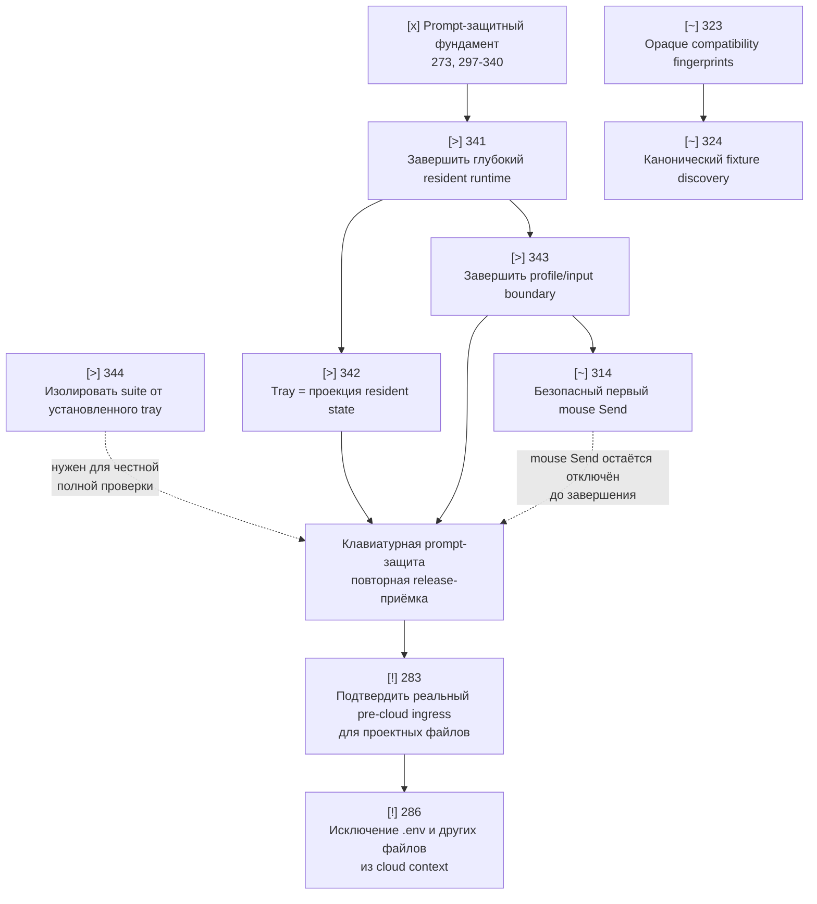

# Ближайший план разработки Code Sanitizer

**Актуально на:** 2026-08-14  
**Назначение:** показать последовательность работ после приёмки основного
prompt-защитного пути и до начала расширения защиты файлов.

## Как читать план

| Метка | Значение |
|---|---|
| `[x]` | Работа завершена и является фундаментом для следующих шагов. |
| `[>]` | Ближайшая выполняемая работа. |
| `[~]` | Может идти после указанной зависимости, но не является текущим критическим путём. |
| `[!]` | Внешняя блокировка: разработка не устранит её без подтверждённой точки интеграции. |

## Что уже построено

Основной prompt-защитный слой уже существует как вертикальный путь:

- [x] Атомарные resident snapshots и fail-closed маршрутизация выбранных
  профилей: 273, 274, 251, 253, 265–267, 277–278.
- [x] Коррелированная операция protected Send, единый владелец overlay,
  revalidation target и raw-free trace: 297, 301–306, 310–313, 315–322.
- [x] Автоматический onboarding, operational lifecycle, журнал, readiness и
  разделение resident admission от release/CI evidence: 325–340.
- [x] Статус честно разделяет `composer_protected` и
  `project_files_protected`; при отсутствии реальной точки ingress файлы
  остаются `project_file_ingress_unsupported`.

Это означает: **не нужно менять принцип работы защиты промптов**. Но review
2026-08-14 показал, что его внутренние границы ещё не закреплены: tray всё ещё
содержит часть workflow, а facade resident runtime пока только переадресует
вызовы. Поэтому 341-343 остаются открытыми и являются критическим путём.

## Карта зависимостей

## Рекомендуемая последовательность

### Этап 1. Закрепить resident runtime

| Очерёдность | Тикет | Результат | Зависимости |
|---:|---|---|---|
| 1 | **341** `[>]` | Довести resident facade до единственного production-порта: tray и input adapter больше не обращаются к `TrayProtectionController` напрямую. | 340 завершён |
| 2 | **342** `[>]` | Вынести setup/retry/recovery ordering из `WindowsTrayApplicationContext`; tray становится проекцией snapshot и диспетчером намерений. | 341 |
| 3 | **343** `[>]` | Все решения после keyboard/pointer callback получают только precomputed resident snapshot; нет чтения profile storage или discovery в callback. | 341; рекомендуется после 342 |
| 4 | **344** `[>]` | Сделать полный автоматический suite независимым от уже запущенного установленного tray приложения. | Можно выполнять параллельно с 341 |

**Контрольная точка после этапа 1:** все автоматические тесты (включая
single-instance fixture при запущенном installed tray), `--self-test`,
`--product-smoke`, новая сборка installer и одна ручная проверка **клавиатурной**
отправки в выбранном OpenAI Desktop composer. Mouse Send ещё не заявляется как
защищённый.

### Этап 2. Закрыть оставшиеся точечные риски prompt-защиты

| Очерёдность | Тикет | Результат | Зависимости |
|---:|---|---|---|
| 4 | **323** `[~]` | Compatibility evidence хранится и сравнивается как явно opaque fingerprint. | Независим от 341–343, но разумно делать после них |
| 5 | **324** `[~]` | Один канонический fixture для verified ChatGPT discovery; тесты больше не расходятся по словарям evidence. | 323 |
| 6 | **314** `[~]` | Первый клик по Send безопасно решается из resident evidence до UIA; нет глобальной блокировки навигации. | Формально 297 и 309 завершены; архитектурно лучше после 343 |

**Правило до завершения 314:** пользовательский mouse Send не считается
защищённым и не должен включаться в capability claim. Защищённым путём остаётся
только проверенная клавиатурная комбинация.

### Этап 3. Отдельная ветка: защита файлов

| Статус | Тикет | Что требуется на самом деле |
|---|---|---|
| `[!]` | **283** | Не «дописать broker», а найти и подтвердить реальную supported pre-cloud точку, через которую Codex/ChatGPT Desktop получает project files, attachments и file-derived tool output. Альтернатива: согласованный локальный gateway, который действительно владеет этими операциями. |
| `[!]` | **286** | После 283 добавить UI и enforcement для `.env` и произвольных файлов, исключаемых из cloud context. |

`283` заблокирован не кодом проекта, а отсутствием подтверждённой интеграционной
точки в Windows Codex/ChatGPT Desktop. До её появления сохраняется честный
статус `project_file_ingress_unsupported`; локальный broker не следует выдавать
за защиту реальных project reads.

## Что делать прямо сейчас

1. Реализовать **344** либо убедиться, что полный suite не конфликтует с
   установленным tray. Это снимает ложные результаты проверки.
2. Завершить **341**: facade не должен быть forwarding-wrapper, он должен стать
   единственным port resident runtime.
3. Реализовать **342**, затем **343**; после каждого тикета повторять review и
   полный автоматический набор проверок.
4. Пересобрать installer и провести одну ограниченную ручную приёмку
   клавиатурного protected Send.
5. Только после этого брать `323 -> 324 -> 314` и начинать исследование
   внешней интеграционной возможности для `283`.

## Границы, которые нельзя размывать

- Tray не принимает решение, защищена ли отправка: он только отображает
  published resident state.
- Ошибка, неопределённость или устаревшее состояние выбранного target всегда
  блокируют исходный Send; они не создают дополнительный pass-through путь.
- Защита composer не равна защите файлов.
- До реального ingress seam нельзя обещать, что Codex/ChatGPT Desktop не
  отправит в облако содержимое файлов проекта.
- Каждая новая задача должна определять владельца состояния, fail-closed
  состояние, допустимые переходы и детерминированное доказательство.
