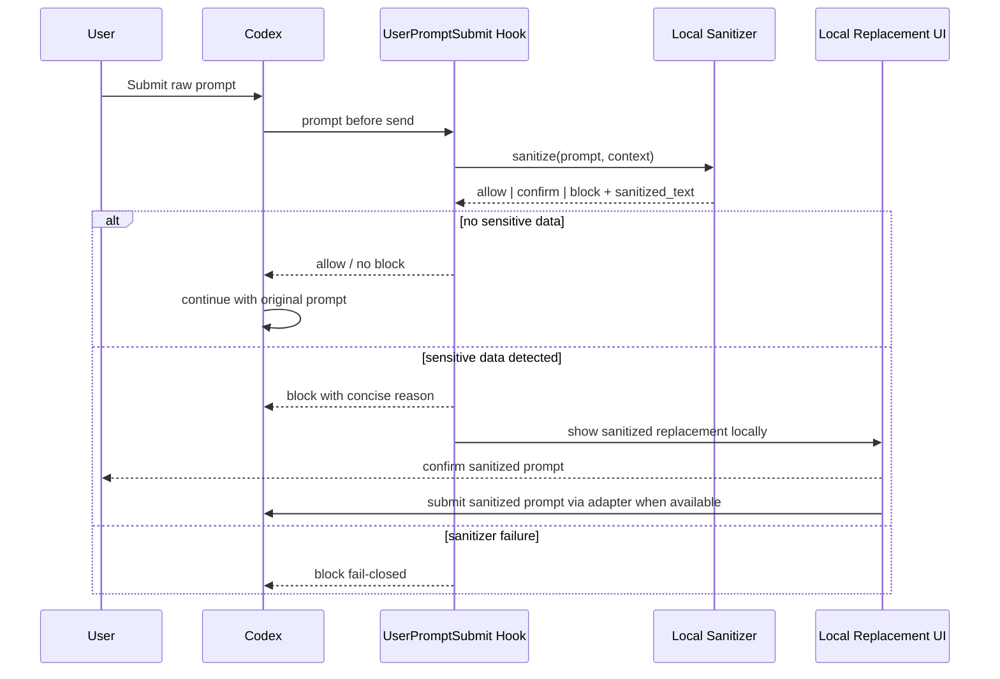
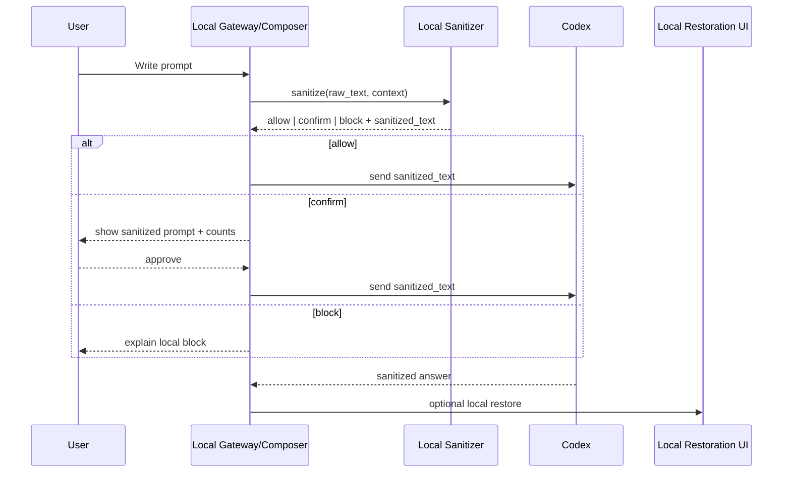
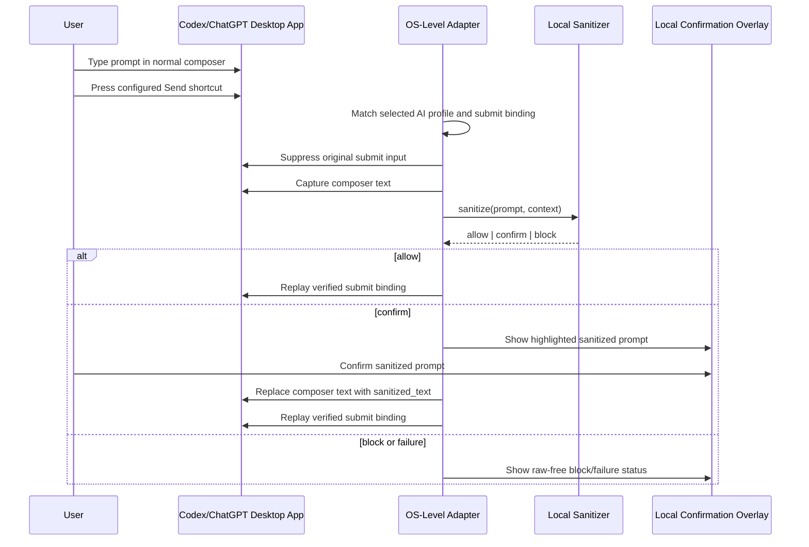

# Prompt Interception

## Goal

The system must inspect prompt text before it is sent to Codex/OpenAI and must prevent the original prompt from crossing the cloud boundary when sensitive data is detected.

There are two implementation modes:

- Guard mode: use Codex `UserPromptSubmit` or an equivalent pre-submit hook to scan and block unsafe prompts.
- Gateway mode: use a local composer, desktop overlay, browser extension, or future official rewrite API that owns the submit action and can send sanitized text directly.

Guard mode is the first enforceable safety slice. The MVP user experience requires a gateway/composer/desktop adapter that can submit sanitized text after confirmation; hook-only clipboard handoff is fallback behavior.

For the Windows Codex/ChatGPT desktop app workflow, the primary product UX is OS-level native submit interception. The user keeps typing in the normal app composer and presses the same Send shortcut configured in the selected AI app. Code Sanitizer intercepts that submit input before cloud submission, suppresses the original send, sanitizes locally, and then either replays the verified submit binding for safe prompts or applies/sends only `sanitized_text` after confirmation. A dedicated sanitizer hotkey remains a secondary manual/diagnostic feature, not the main safety mechanism.

The resident application must be installed and launched as a normal Windows tray app. The user should not need a console window for protection. Exiting, stopping protection, or unloading the tray app requires explicit confirmation because it removes the local guard from selected AI apps.

## Verified Codex Hook Behavior

As of 2026-07-15, the published Codex hooks documentation says `UserPromptSubmit` receives a `prompt` field containing the user prompt that is about to be sent. The same documentation describes adding extra developer context or blocking the prompt with `decision: "block"` for this event. It does not describe `updatedInput` or prompt rewriting for `UserPromptSubmit`; documented rewriting is shown for `PreToolUse`, not for `UserPromptSubmit`.

Architecture consequence: a Codex hook adapter must be treated as a guard unless prompt rewriting is later verified by official documentation or a working prototype.

## Guard Mode Flow



In pure hook-only guard mode, the user may need one extra fallback action to resubmit sanitized text. The target MVP path is adapter-owned confirm-and-send. The hook must never approve the raw prompt after sensitive data is detected.

## Gateway Mode Flow



Gateway mode can satisfy the intended "replace and send" workflow because the local component controls the submit button.

## Adapter State Machine

```text
Idle
  -> CapturingPrompt
  -> Sanitizing
  -> NoSensitiveData: send original/sanitized-equivalent prompt
  -> NeedsConfirmation: show sanitized text
  -> SendingSanitized: send sanitized_text only
  -> Blocked: do not send
  -> FailedClosed: do not send
```

Required invariants:

- `raw_text` is read only by local sanitizer components.
- `sanitized_text` is the only cloud-bound payload after sensitive data is detected.
- `block` always wins over user convenience.
- a sanitizer crash, policy load error, vault error, or verification error becomes `FailedClosed`.

## Hook Adapter Contract

Input from Codex:

```text
UserPromptSubmit
- turn_id
- prompt
- common context fields
```

Processing:

```text
result = sanitizer.sanitize({
  raw_text: input.prompt,
  context: codex_context(input)
})
```

Output:

- `allow`: return success without adding raw sensitive context.
- `confirm` or `block`: return `decision: "block"` with a short reason.
- open local UI for sanitized confirmation; clipboard/temp handoff is fallback only.

The block reason should be terse and should not include raw values:

```json
{
  "decision": "block",
  "reason": "Sensitive data detected. Use the sanitized prompt from Codex Redaction Gate."
}
```

## Gateway Adapter Contract

Gateway adapter must:

- own the prompt entry field and submit action;
- call the sanitizer before network submission;
- display highlighted sanitized prompt, replacement summary and counts when confirmation is required;
- submit only `sanitized_text`;
- keep mapping vault and raw prompt local;
- mark restored output as local-sensitive;
- re-sanitize restored output if the user tries to submit it again.

## Replacement Handoff In Guard Mode

Because guard mode may not rewrite the prompt directly, the system needs a safe handoff path for sanitized text:

- preferred MVP: local confirmation window with `Confirm sanitized prompt`, where the adapter submits only `sanitized_text`;
- fallback: `Copy sanitized prompt` only after an explicit user click if no submit-owning adapter is available;
- acceptable diagnostic mode: write sanitized prompt to a local temp file under `%USERPROFILE%\.codex-redaction-gate\handoff` with restrictive ACLs;
- not acceptable: include sanitized or raw prompt in the hook block reason when it is long or may contain residual sensitive context.

The hook output should contain only the reason and instructions, not the raw prompt.

## Analysis and Replacement Sequence

The adapter does not decide what is sensitive. It only passes text to the sanitizer and enforces the result.

```text
capture prompt
  -> preflight
  -> detector registry
  -> span resolver
  -> policy engine
  -> mapping vault
  -> renderer
  -> verifier
  -> adapter decision
```

If the verifier detects any selected raw span in `sanitized_text`, the adapter receives `block`.

## OS-Level Native Submit Interception Flow



The adapter must fail closed if it cannot confidently match the selected AI app, read the composer, write back sanitized text when needed, or verify the active submit binding. Hotkey-triggered dry-run/apply-only remains a diagnostic path but is not sufficient for production protection.

## Selected AI Surface Profiles

Code Sanitizer must protect only user-selected AI surfaces. Each profile records:

- application identity, process/window signals and UI Automation composer shape;
- whether the profile is enabled;
- how the profile's submit binding is discovered: `documented_config`, `empirical_config` or `user_verified`;
- the active submit binding, such as `Enter`, `Ctrl+Enter` or another user-configured shortcut;
- the active newline binding, such as `Shift+Enter`, `Ctrl+Enter` or another user-configured shortcut;
- the app/package version compatibility evidence and last raw-free verification result;
- current capability status: `protected`, `not_configured`, `binding_unknown`, `surface_unverified`, or `degraded_hotkey_only`.

If the configured AI app cannot be matched or its submit binding cannot be discovered/verified, the tray/menu must show that the app is not protected. The system must not silently fall back to assuming `Enter`.

## Submit Binding Verification

As of 2026-07-20, no stable local configuration source is confirmed for the prompt submit shortcut in Windows Codex/ChatGPT Desktop. The product must therefore treat `user_verified` binding capture as the release path. Config discovery can be added only when the source is documented by the vendor or proven empirically across app updates.

Binding verification must be local and non-cloud. Onboarding records the submit gesture and newline gesture against the selected AI surface, verifies that the focused element still matches the known composer shape, and stores raw-free evidence. If submit and newline cannot be separated, the profile remains `binding_unknown` or `surface_unverified`.

The protected trigger shown in the product UI is the selected AI app's verified `submit_binding`. It must not be confused with the secondary manual scan/apply hotkey. If the selected AI app uses `Enter` for Send and `Ctrl+Enter` for newline, native interception protects `Enter` in that verified composer and passes `Ctrl+Enter` through.

## Emergency Escape And Enterprise Enforcement

Native interception must provide a visible emergency escape: a tray action and a hard-to-trigger local chord such as `Ctrl+Alt+Shift+Pause` that temporarily disables protection for the current app. This action is audited raw-free and never replays the original submit input.

Enterprise policy may lock protected profiles, block user removal, and forbid silent `degraded_hotkey_only` fallback. If a required profile is open but unverified, the policy decides whether submit is blocked or allowed only with a visible unprotected warning.

## MVP Recommendation

Implement in this order:

1. Local sanitizer library and CLI tester.
2. Global policy/dictionary files.
3. `UserPromptSubmit` guard hook that blocks unsafe prompts.
4. AI profile manager for Windows Codex/ChatGPT Desktop, including submit-binding discovery/verification and explicit user selection.
5. OS-level Windows adapter with native submit interception for selected protected AI surfaces.
6. Hotkey-triggered dry-run/apply-only as secondary diagnostics and rescue.
7. Future Linux desktop and CLI wrapper adapters behind the same interaction contracts.

This gives immediate protection without pretending that hook-only replacement is already available.

## References

- Codex Hooks documentation: `https://learn.chatgpt.com/docs/hooks`
